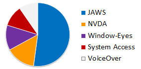

# Sample Document

This document was created using accessibility techniques for headings,
lists, image alternate text, tables, and columns. It should be
completely accessible using assistive technologies such as screen
readers.

## Headings

There are eight section headings in this document. At the beginning,
"Sample Document" is a level 1 heading. The main section headings, such
as "Headings" and "Lists" are level 2 headings. The Tables section
contains two sub-headings, "Simple Table" and "Complex Table," which are
both level 3 headings.

## Lists

The following outline of the sections of this document is an ordered
(numbered) list with six items. The fifth item, "Tables," contains a
nested unordered (bulleted) list with two items.

1.  Headings

2.  Lists

3.  Links

4.  Images

5.  Tables

- Simple Tables

- Complex Tables

6.  Columns

## Links

In web documents, links can point different locations on the page,
different pages, or even downloadable documents, such as Word documents
or PDFs:

[Top of this Page](#sample-document)  
[Sample Document](http://www.dhs.state.il.us/page.aspx?item=67072)  
[Sample Document
(docx)](http://www.dhs.state.il.us/OneNetLibrary/27897/documents/Initiatives/IITAA/Sample-Document.docx)

## Images

Documents
may contain images. For example, there is an image of the web
accessibility symbol to the left of this paragraph. Its alternate text
is "Web Access Symbol".

Alt text should communicate what an image means, not how it looks.

Some
images, such as charts or graphs, require long descriptions, but not all
document types allow that. In web pages, long descriptions may be
provided in several ways: on the page below the image, via a link below
the image, or via a link on the image.

## Tables

### Simple Tables

Simple tables have a uniform number of columns and rows, without any
merged cells:

<table>
<colgroup>
<col style="width: 42%" />
<col style="width: 33%" />
<col style="width: 23%" />
</colgroup>
<thead>
<tr>
<th><strong>Screen Reader</strong></th>
<th><strong>Responses</strong></th>
<th><strong>Share</strong></th>
</tr>
<tr>
<th>JAWS</th>
<th>853</th>
<th>49%</th>
</tr>
<tr>
<th>NVDA</th>
<th>238</th>
<th>14%</th>
</tr>
<tr>
<th>Window-Eyes</th>
<th>214</th>
<th>12%</th>
</tr>
<tr>
<th>System Access</th>
<th>181</th>
<th>10%</th>
</tr>
<tr>
<th>VoiceOver</th>
<th>159</th>
<th>9%</th>
</tr>
</thead>
<tbody>
</tbody>
</table>

### Complex Tables

The following is a complex table, using merged cells as headers for
sections within the table. This can't be made accessible in all types of
documents:

<table>
<colgroup>
<col style="width: 19%" />
<col style="width: 20%" />
<col style="width: 20%" />
<col style="width: 20%" />
<col style="width: 20%" />
</colgroup>
<thead>
<tr>
<th></th>
<th colspan="2"><strong>May 2012</strong></th>
<th colspan="2"><strong>September 2010</strong></th>
</tr>
</thead>
<tbody>
<tr>
<td><strong>Screen Reader</strong></td>
<td><strong>Responses</strong></td>
<td><strong>Share</strong></td>
<td><strong>Responses</strong></td>
<td><strong>Share</strong></td>
</tr>
<tr>
<td>JAWS</td>
<td>853</td>
<td>49%</td>
<td>727</td>
<td>59%</td>
</tr>
<tr>
<td>NVDA</td>
<td>238</td>
<td>14%</td>
<td>105</td>
<td>9%</td>
</tr>
<tr>
<td>Window-Eyes</td>
<td>214</td>
<td>12%</td>
<td>138</td>
<td>11%</td>
</tr>
<tr>
<td>System Access</td>
<td>181</td>
<td>10%</td>
<td>58</td>
<td>5%</td>
</tr>
<tr>
<td>VoiceOver</td>
<td>159</td>
<td>9%</td>
<td>120</td>
<td>10%</td>
</tr>
</tbody>
</table>

## Columns

This is an example of columns. With columns, the page is split into two
or more horizontal sections. Unlike tables, in which you usually read
across a row and then down to the next, in columns, you read down a
column and then across to the next.  
When columns are not created correctly, screen readers may run lines
together, reading the first line of the first column, then the first
line of the second column, then the second line of the first column, and
so on. Obviously, that is not accessible.
